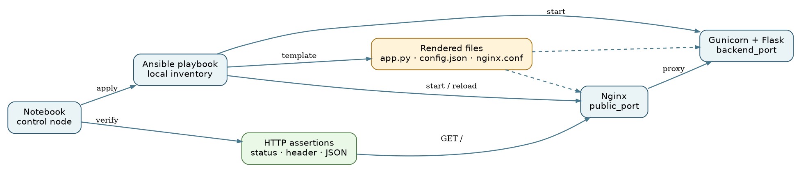

# DD2482 executable tutorial: Infrastructure as Code with Ansible

Deploy, test, drift, repair, and update a web service on a temporary Google Colab VM. The tutorial is for DD2482's Week 5 Infrastructure as Code topic.

[Open the notebook in Google Colab](https://colab.research.google.com/github/TheArtemis/DD2482-executable-tutorial/blob/main/DD2482_Ansible_IaC_Tutorial.ipynb)

## Run it

1. Open the link above and select a standard Colab Python runtime. If your local edits are not yet on GitHub, open [Colab](https://colab.research.google.com/) and use **File → Upload notebook** to run the local `.ipynb` file.
2. Run the notebook cells in order. On Colab, setup installs Ansible and the playbook installs Nginx, Flask, and Gunicorn.
3. Read each recap and diff, and complete the reflection prompts.
4. Run the final cleanup cell to stop the tutorial services and remove their files.

No cloud provider credentials, payment details, or local installation are needed for Colab. A free Google account may be needed to use it. Requests stay on `localhost`. The first setup can take several minutes while packages install.

## Run locally with uv

On Debian or Ubuntu Linux, install [uv](https://docs.astral.sh/uv/getting-started/installation/) and run:

```bash
uv sync --python 3.12
uv run --locked python scripts/check_notebook.py
```

Select `.venv/bin/python` as the notebook kernel in VS Code, then run the notebook cells in order. The `uv` environment includes `ipykernel`, Ansible, Flask, and Gunicorn. When Nginx is not installed, the setup cell downloads and extracts the distribution package into a temporary directory; it does not require administrator privileges. Local execution needs `apt-get`, `dpkg-deb`, and network access for that download. The final cell stops both tutorial processes and removes the temporary working directory. The `uv` environment remains available for later runs.

The check command above validates notebook code, rendered templates, the playbook, and Ansible syntax without starting services. For the full web-service exercise, run the notebook itself.

## What the notebook demonstrates



Ansible targets `localhost` through a local inventory. It renders an application, a JSON configuration file, and an Nginx reverse proxy configuration from Jinja templates. Gunicorn serves Flask on the selected backend port; Nginx proxies the selected public port to it. The notebook prefers ports 8000 and 8080 but chooses free alternatives when needed. HTTP assertions check the status, JSON values, and a proxy response header.

The workflow checks syntax and previews changes, applies the playbook, verifies the service, proves a second run has `changed=0`, edits a managed file to create drift, previews and repairs that drift, and performs a declared version update from `1.0` to `2.0`. The notebook ends with design trade-offs and cleanup.

## Files

| File | Purpose |
| --- | --- |
| [DD2482_Ansible_IaC_Tutorial.ipynb](DD2482_Ansible_IaC_Tutorial.ipynb) | Complete executable tutorial; its cells create the Ansible inventory, variables, templates, and playbook. |
| [assets/architecture.png](assets/architecture.png) | Architecture diagram referenced by the notebook. |
| [LICENSE](LICENSE) | Repository license. |

The notebook uses `/content/dd2482-ansible-tutorial` on Colab and `/tmp/dd2482-ansible-tutorial-<uid>` locally. Its cleanup cell removes the working directory and stops the two tutorial processes. Installed packages remain in the disposable Colab VM or the local `.venv`.

The tutorial addresses the [DD2482 executable-tutorial criteria](https://github.com/KTH/devops-course/blob/2026/grading-criteria.md#executable-tutorial): browser execution without complex accounts, stated learning outcomes, a nontrivial integrated workflow, and explanations of relevance, architecture, decisions, limitations, and results.
