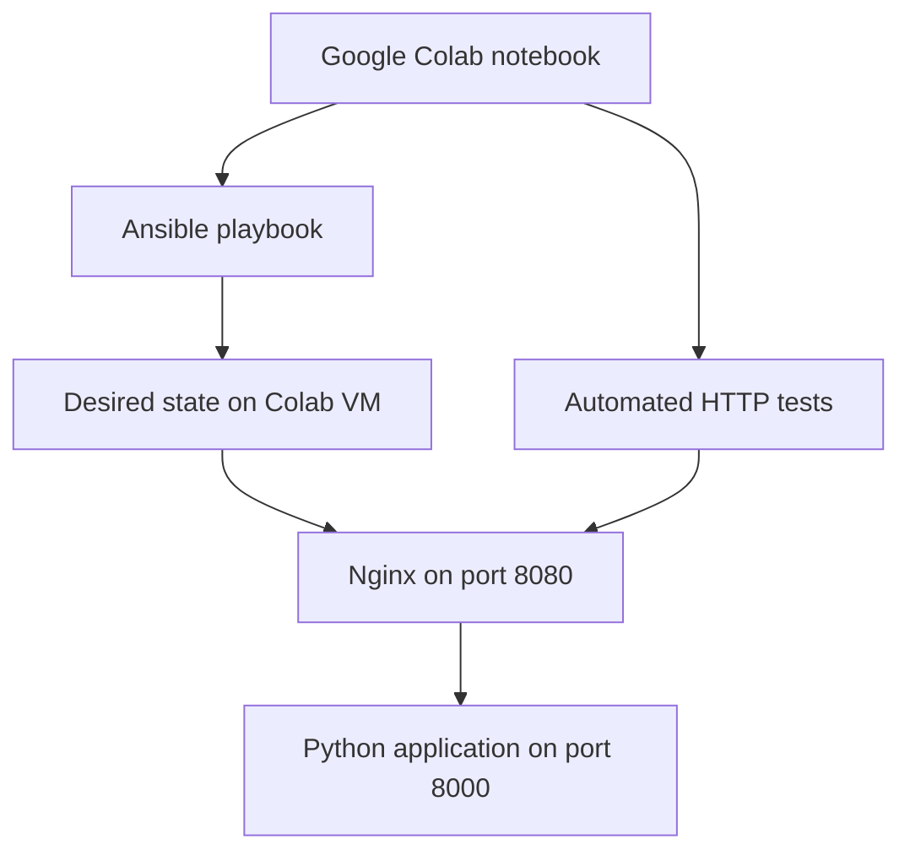

# DD2482 Executable Tutorial Proposal

## Infrastructure as Code with Ansible: Deploy, Test, and Repair a Web Service

This repository will contain an executable tutorial for **DD2482 – Automated
Software Testing and DevOps** at KTH. The tutorial is intended for the course's
Week 5 topic, **Infrastructure as Code (IaC)**.

The tutorial will use Ansible to configure the Google Colab virtual machine
itself. It will deploy a small Python web application behind Nginx, verify the
deployment automatically, demonstrate idempotency, introduce configuration
drift, and repair that drift by reapplying the declared configuration.

Everything will run from a browser in Google Colab. The learner will not need a
cloud account, payment information, credentials, or a local installation.

## Motivation

Manually configuring servers is difficult to reproduce and audit. Commands can
be forgotten, machines can gradually acquire different configurations, and an
environment can become difficult to rebuild after a failure. This is commonly
known as configuration drift.

Infrastructure as Code addresses these problems by storing the desired
configuration in version-controlled files and applying it automatically. In
this tutorial, Ansible will describe the desired state of a small web-service
stack and repeatedly bring the Colab VM into that state.

## Intended learning outcomes

After completing the tutorial, the learner should be able to:

1. Explain desired state, idempotency, and configuration drift in the context
   of Infrastructure as Code.
2. Create and understand a basic Ansible inventory and playbook.
3. Use Ansible variables and Jinja templates to generate configuration files.
4. Deploy and verify a web service made from multiple interacting components.
5. Demonstrate that an Ansible playbook is idempotent.
6. Detect and repair an unintended configuration change.
7. Explain when Ansible is appropriate and when another IaC tool may be a
   better choice.

## System architecture



The notebook acts as both the learning interface and the Ansible control node.
Ansible connects to `localhost` and configures the Colab VM as its managed
node. Nginx accepts requests on port 8080 and forwards them to the Python
application on port 8000. Automated tests access the application through Nginx
so that the complete request path is verified.

## Planned tutorial

### 1. Introduce the problem

The tutorial begins with a short explanation of why manual server
configuration is unreliable:

- Commands may be forgotten or executed in the wrong order.
- Environments configured by hand may not be identical.
- Manual changes can cause configuration drift.
- Rebuilding an environment after a failure becomes difficult.

It then introduces configuration management, desired state, convergence, and
idempotency. Ansible is presented as the tool that will automate the example.

### 2. Prepare the Colab environment

An executable cell will:

- install Ansible, Nginx, Flask, and Gunicorn;
- create a clean working directory for the tutorial;
- display the installed tool versions; and
- confirm that the required ports are available.

The setup will be designed so that it can safely be executed more than once.

### 3. Create the inventory and variables

The notebook will create an Ansible inventory that targets the Colab VM:

```ini
[colab]
localhost ansible_connection=local
```

The learner will then inspect variables describing the desired deployment,
including:

- application name;
- application version;
- environment name;
- backend application port; and
- public Nginx port.

This section will explain the roles of the inventory, playbook, and variables,
and why deployment-specific values should not be hard-coded throughout the
configuration.

### 4. Define the application and configuration templates

Ansible and Jinja templates will be used to produce:

- a small Flask application;
- an application configuration file; and
- an Nginx reverse-proxy configuration.

The application endpoint will return deployment information similar to:

```json
{
  "application": "dd2482-demo",
  "version": "1.0",
  "environment": "tutorial"
}
```

Because the response is based on the declared variables, configuration changes
will be easy to observe and verify.

### 5. Validate before deployment

Before changing the VM, the learner will run:

```bash
ansible-playbook --syntax-check playbook.yml
ansible-playbook --check --diff playbook.yml
```

Syntax checking catches malformed configuration. Check mode previews the
changes Ansible expects to make, while diff mode shows how managed files would
change. This section will relate validation to reviewing an infrastructure
change before applying it.

### 6. Apply the desired state

The playbook will then configure the VM. Its tasks will:

- install or verify the required packages;
- create the application directories;
- render configuration files from templates;
- configure and start the Python application;
- configure and start Nginx; and
- wait until the HTTP endpoint is ready.

The learner will inspect Ansible's recap and distinguish between tasks that
reported `ok` and tasks that reported `changed`.

### 7. Verify the deployment automatically

Python assertions will verify that:

- Nginx returns HTTP status `200`;
- the response contains the expected application name;
- the deployed version matches the declared version;
- the environment value is correct; and
- Nginx is successfully forwarding requests to the backend application.

An incorrect deployment will therefore make the notebook cell fail visibly.
This demonstrates that automation should verify its outcome rather than only
assume that a successful command produced a working system.

### 8. Demonstrate idempotency

The learner will execute the same playbook a second time. Since the VM already
matches the desired state, Ansible should not make unnecessary changes. The
tutorial will inspect the second recap and assert that it reports zero changed
resources.

This demonstrates an important property of configuration management: repeated
execution should converge on the same state instead of repeatedly modifying
the system.

### 9. Introduce configuration drift

The notebook will deliberately modify an Ansible-managed file outside the
playbook, simulating an undocumented manual server change. For example, it may
replace the configured application version or environment name.

The learner will run check and diff mode again to see that the actual state no
longer matches the desired state.

### 10. Repair the environment

The playbook will be reapplied. Ansible should detect the modified file,
restore the declared configuration, and leave unrelated resources unchanged.
The automated HTTP tests will then run again and confirm that the correct
service has been restored.

This is the main practical lesson of the tutorial: version-controlled
configuration can be used both to create an environment and to recover its
intended state after drift.

### 11. Perform a controlled update

The application version will be intentionally changed from `1.0` to `2.0` in
the Ansible variables. The learner will:

1. preview the proposed change;
2. apply the playbook;
3. verify that the service now reports version `2.0`; and
4. execute the playbook once more to confirm idempotency.

This section distinguishes a reviewed change to the desired state from an
unrecorded manual modification.

### 12. Reflect on the design

The final discussion will cover:

- why Ansible was chosen for operating-system and application configuration;
- why `localhost` is used to make the tutorial browser-only;
- why variables and templates are preferable to duplicated commands;
- why automated verification is included in the deployment workflow;
- limitations of representing a production system with one temporary VM;
- how the inventory could be changed to target remote machines;
- why secrets should not be stored directly in a playbook; and
- how Ansible can complement provisioning tools such as Terraform.

Ansible is useful when machines already exist and their packages, files, and
services must be configured. Terraform is generally more suitable for creating
cloud resources such as networks, virtual machines, and managed databases. A
production workflow may use both tools.

### 13. Clean up

The final executable cell will stop the tutorial processes and remove the
tutorial-specific configuration. This will make it possible to restart the
tutorial from a clean state within the same Colab session.

## Planned repository structure

```text
DD2482-executable-tutorial/
├── README.md
├── DD2482_Ansible_IaC_Tutorial.ipynb
├── LICENSE
└── assets/
    └── architecture.png
```

Most Ansible files will be created by executable notebook cells. Consequently,
opening the notebook in Colab will be sufficient to complete the tutorial.

## Assessment-criteria coverage

The plan is designed around the course's
[executable-tutorial grading criteria](https://github.com/KTH/devops-course/blob/2026/grading-criteria.md#executable-tutorial).

| Criterion | How it will be addressed |
| --- | --- |
| No Account — mandatory | The tutorial runs on a free Colab VM and requires no cloud account or credentials. |
| Executability — mandatory | The tutorial is executed sequentially in the browser using notebook cells. |
| ILO — mandatory | Intended learning outcomes are stated at the beginning. |
| Technical Depth | Ansible, Jinja templates, Flask, Gunicorn, Nginx, and automated tests interact in one workflow. |
| Relevance | The tutorial demonstrates IaC, automation, reproducibility, idempotency, and drift repair. |
| System Reasoning | An architecture figure and explanations describe the components and request flow. |
| Design Decisions | The choice of tools, local architecture, templates, and verification is justified. |
| Reflection | The tutorial discusses appropriate uses, limitations, production differences, and alternatives. |
| Narrative/Structure | The flow is problem, setup, deployment, verification, drift, repair, update, and reflection. |
| Visuals | The architecture diagram and configuration diffs support the explanation. |
| Language | Each executable step is introduced with a concise explanation of what it does and why. |

The tutorial therefore aims to satisfy all mandatory requirements and all
eight additional yes/no criteria.

## Expected result

At the end of the tutorial, the learner will have used one reproducible
Ansible playbook to deploy and test a functioning web-service stack, prove that
the configuration is idempotent, observe configuration drift, repair it, and
perform a controlled version update—all inside a Google Colab VM.
